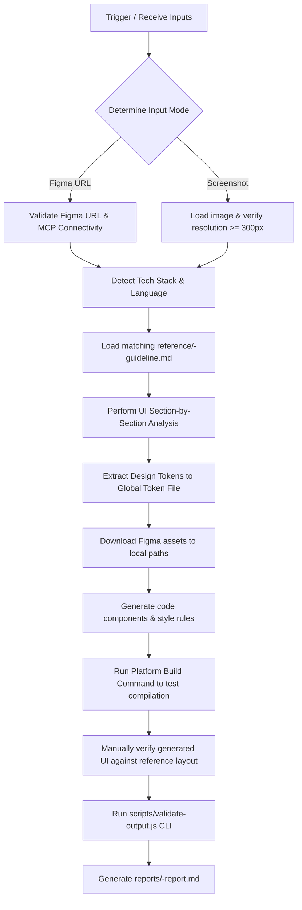

# Figma UI Generator MCP Skill

> **Version:** 5.9.0 | **Status:** Active | **Platforms:** Angular · React · React Native · Flutter · iOS (SwiftUI / UIKit) · Android (Compose / XML)

The **Figma UI Generator** is a production-grade MCP skill designed to convert Figma design layouts or design screenshots directly into semantic, responsive, and styled UI components for any target platform. It automatically detects the project's codebase stack, extracts design tokens to global style configurations, downloads vector and image assets locally, enforces mobile responsiveness, and runs platform-specific compiler builds and manual visual verification to guarantee design fidelity.

---

## 1. Prerequisites and Dependencies

To integrate and execute this skill, ensure your local development workspace satisfies the following requirements:

### Systems & Runtimes
- **Node.js:** Version $\ge 14$ installed (required to execute the `scripts/validate-output.js` post-generation checks).
- **Platform Compiler Tooling:** The CLI build tools for your target platform must be installed and globally accessible in your environment to perform verification builds:
  - **Angular:** Angular CLI (`ng build`)
  - **React:** Build script runner (`npm run build` or `vite build`)
  - **React Native:** Metro Bundler & TypeScript compiler
  - **Flutter:** Flutter SDK (`flutter build`)
  - **iOS:** Xcode CLI tools (`xcodebuild` / `ibtool`)
  - **Android:** Android SDK / Gradle (`./gradlew assembleDebug`)

### External Services (Figma Mode Only)
- **Figma Desktop MCP Server:** Must be running locally and reachable on `http://localhost:3845`.
- **Figma API Access:** The MCP client must be configured with a valid Figma API key to retrieve node details and layer trees.

### Design Assets
- **Figma Node URL:** A URL pointing directly to the frame or node (e.g., `https://www.figma.com/design/...&node-id=...`)
- **Attached Screenshots:** If Figma MCP is unreachable or you are converting an image directly, a PNG/JPG/WEBP design screenshot must be provided, with a minimum resolution of $300\text{px}$ on its shortest side.

---

## 2. Step-by-Step Integration Instructions

### Step 1: Copy the Skill into the Workspace
Create or verify that the skill folder is located under the standard registry in your project workspace:
```text
.github/skills/figma-ui-generator/
```

Confirm that the folder hierarchy contains all reference guidelines, validation scripts, and templates:
```text
figma-ui-generator/
├── SKILL.md                 # Main orchestration & trigger contract
├── metadata.yaml            # Skill metadata, category, and changelog registry
├── assets/                  # Quality rules and template configurations
│   ├── fail-conditions.md
│   ├── quality-rules.md
│   └── report-template.md
├── examples/                # Token extraction formats and code templates
│   ├── ios-code-examples.md
│   ├── platform-code-examples.md
│   ├── platform-output-samples.md
│   └── token-extraction-reference.md
├── references/              # Platform-specific structural guidelines
│   ├── android-guideline.md
│   ├── angular-guideline-analysis.md
│   ├── angular-guideline-build.md
│   ├── angular-guideline-mapping.md
│   ├── angular-guideline-rules.md
│   ├── flutter-guideline-rules.md
│   ├── flutter-guideline-steps.md
│   ├── ios-swiftui-controls.md
│   ├── ios-swiftui-guideline.md
│   ├── ios-uikit-guideline.md
│   ├── ios-uikit-storyboard-rules.md
│   ├── react-guideline-analysis.md
│   ├── react-guideline-build.md
│   ├── react-guideline-rules.md
│   └── react-native-guideline.md
└── scripts/                 # Execution helpers and validators
    ├── figma-ui-generator.js
    └── validate-output.js
```

### Step 2: Configure Environment Variables
For Figma Mode integrations, ensure your local environment contains the required Figma access token:
```bash
export FIGMA_ACCESS_TOKEN="your_personal_access_token_here"
```

### Step 3: Trigger the Skill in Chat
You can trigger the skill in your AI assistant by initiating a request that matches the trigger keywords. For example:
> *"Create a new component `PaymentDetailsCard` under the `billing` feature from this Figma URL: `https://www.figma.com/design/AbCd123/Main-UI?node-id=102-14`"*

---

## 3. AI Agent Inputs

The AI agent expects five primary parameters when invoking the skill. 

### Input Parameters & Descriptions

| Input Key | Data Type | Required | Description | Example |
| :--- | :--- | :---: | :--- | :--- |
| `figmaUrl` | `string` | **Yes\*** | Figma file design URL containing node-id segment. | `https://www.figma.com/design/AbC123/Project?node-id=2-4` |
| `screenshot` | `image` | **Yes\*** | Attached PNG, JPG, or WEBP screenshot of the design. | *(Binary image attachment)* |
| `componentName` | `string` | **Yes** | PascalCase component name. Used for files and classes. | `LoginForm`, `SettingsToggle` |
| `featureName` | `string` | **Yes** | Lowercase folder label for domain isolation. | `auth`, `dashboard`, `checkout` |
| `targetPlatform` | `string` | No | Overrides auto-detection. Options: `angular` \| `react` \| `react-native` \| `flutter` \| `ios` \| `android` \| `web` | `flutter` |

*\*Note: Provide at least one of `figmaUrl` or `screenshot`. If both are provided, the `figmaUrl` is used as the primary source of truth, while the screenshot serves as a visual reference.*

### Input Examples

#### Example 1: Direct Figma URL (Figma Mode)
```yaml
figmaUrl: "https://www.figma.com/design/XYZ12345/ClientDashboard?node-id=12-340"
componentName: "SummaryCard"
featureName: "dashboard"
```

#### Example 2: Screenshot Ingestion (Screenshot Mode)
```yaml
screenshot: [Attached: notification_panel.png]
componentName: "NotificationPanel"
featureName: "notifications"
```

#### Example 3: Explicit Platform Override
```yaml
figmaUrl: "https://www.figma.com/design/XYZ12345/ClientDashboard?node-id=55-12"
componentName: "SettingsMenu"
featureName: "settings"
targetPlatform: "angular"
```

---

## 4. Configuration and Setup Details

The skill executes dynamically based on assets and files located in the project workspace:

### Tech Stack Detection Sequence
The agent scans files at the project root in this exact order to determine the stack:
1. `package.json` (React, Angular, React Native dependencies)
2. `pubspec.yaml` (Flutter dependencies)
3. `build.gradle` / `settings.gradle` (Android configurations)
4. Config lockfiles (`package-lock.json`, `Podfile.lock`, etc.)
5. Source extensions (`.swift`, `.dart`, `.tsx`, `.ts`)
6. Directory markers (`ios/`, `android/`, `lib/`, `src/`)

### Global Token Targets
Extracted design tokens (colors, text styling, spacing, corner radius, box-shadows, media breakpoints) are appended to the project's central variables registry:
- **Angular:** `src/styles/_variables.scss`
- **React:** `tailwind.config.ts`
- **React Native:** `src/theme/figma-tokens.ts`
- **Flutter:** `lib/core/theme/app_colors.dart`
- **iOS:** Project-level AppColors configuration
- **Android:** Kotlin constants (`Color.kt`) or layout XML resource definitions (`figma_colors.xml`)

### Asset Storage Directories
Any images or icons downloaded via the Figma Desktop MCP server are written locally to:
- **Web / React / React Native:** `public/assets/figma/`
- **Angular:** `src/assets/figma/`
- **Flutter:** `assets/figma/`
- **iOS:** `Assets.xcassets/Figma/`

---

## 5. Execution Flow and Expected Behavior

The skill enforces a structured, step-by-step pipeline from input parsing to build validation:



1. **Step 1 — Collect User Inputs:** Analyzes input modes and verifies that required names are present.
2. **Step 2 — Validate Design Source:** Verifies connection to the local MCP server or validates that the screenshot resolution is at least $300\text{px}$ on the shortest side.
3. **Step 3 — Detect Tech Stack:** Assesses package manifests to verify platform, framework, and styling approaches.
4. **Step 4 — Load Framework Guideline:** Loads corresponding guides (e.g. `react-guideline-rules.md` or `ios-swiftui-guideline.md`) into context.
5. **Step 5 — UI Section Analysis:** Deconstructs the visual design layout section-by-section before writing any code.
6. **Step 6 — Design Token Extraction:** Identifies and registers design tokens, avoiding hardcoded "magic values".
7. **Step 7 — Asset Download:** Pulls graphics locally and maps them to clean relative paths (removes Figma server endpoints).
8. **Step 8 — Component Generation:** Produces clean layout structure, classes, and styles.
9. **Step 9 — Post-Generation Build Validation:** Executes platform commands to verify compile safety (0 compilation errors).
10. **Step 10 — Visual Comparison:** Manually compares the rendered component UI to the source layout to verify visual correctness.
11. **Step 11 — Run Output Validation Script:** Run the CLI script to evaluate metadata, files, and rules.
12. **Step 12 — Generate Final Report:** Writes a detailed report to `reports/<componentName>-report.md` with compliance verdicts.

---

## 6. Output Details

Upon successful execution, the skill produces:

### Mapped Code Files & Assets
- **Responsive UI Component Code:** The generated files matching target patterns (e.g., `src/app/features/auth/components/LoginForm.component.ts`).
- **Global Token Configs:** Updated spacing, color, typography, and size variable files.
- **Downloaded Media Assets:** Project-local vector/image assets.

### Post-Audit Summary Report
Saves to `reports/<componentName>-report.md` (based on `assets/report-template.md`).

#### Key Report Sections:
- **Metadata:** Component configuration, date, version, platform, delivery mode.
- **Part 1 — Stack Detection:** Detected language, libraries, build engine, and confidence score.
- **Part 2 — UI Component Mapping:** Section-by-section table mapping Figma components to layout code, confirming semantic markup.
- **Part 3 — Design Tokens:** Token generation verification checklist.
- **Part 4 — Assets:** Local download validation check.
- **Part 5 & 6 — Dimension and Typography Accuracy Tables:** Side-by-side matches of widths, padding, fonts, and styling.
- **Part 8 — Visual Comparison:** Logs and mismatch reports with the final percentage score.
- **VERDICT:** Explicitly checked `[x] PASS` or `[x] FAIL` block.

#### Sample Report:
```markdown
# Component Generation Report — UserProfileCard

## Metadata
| Field | Value |
|---|---|
| Component name | UserProfileCard |
| Feature / domain | user |
| Platform | react |
| Delivery mode | Tailwind CSS |
| Input mode | figma |
| Figma URL | https://www.figma.com/design/f123/Profile?node-id=2-10 |
| Generated date | 2026-06-23 |
| Skill version | 5.8.0 |

## Part 1 — Stack Detection
| Dimension | Detected value | Evidence file |
|---|---|---|
| platform | web | package.json |
| framework | react | package.json |
| styling_approach| tailwind-css | tailwind.config.ts |
| Confidence level | high | |

## VERDICT
**[x] PASS — all checks green, visual score 98.2%, build successful**
```

---

## 7. Error Scenarios and Troubleshooting

| Diagnostic Symptom / Error | Potential Cause | Resolution / Remedy |
| :--- | :--- | :--- |
| **`status: BLOCKED`** (Figma MCP Unreachable) | Figma Desktop MCP server is offline, crashed, or blocked by local port configurations. | 1. Ensure the Figma Desktop application is open.<br>2. Confirm the Figma MCP server is listening on port 3845.<br>3. Alternatively, fall back to **Screenshot Mode** by attaching a PNG/JPG. |
| **`status: BLOCKED`** (Low-Resolution Image) | The attached screenshot is blurry or measures less than $300\text{px}$ on the shortest side. | Capture and upload a high-resolution screenshot with visible, readable labels and clear layouts. |
| **Validation Fail: `localhost:3845` URLs remaining in code** | Figma asset compilation did not clean up the local server resource endpoints. | Find and replace all occurrences of `http://localhost:3845/...` in your code with relative paths to downloaded assets in your assets folder. |
| **Validation Fail: Inline magic values detected** | Styling sheets contain hardcoded colors (`#1A1A1A`) or sizes (`24px`) instead of tokens. | Extract raw hexes/dimensions to your platform token file (e.g. `_variables.scss`) and reference the corresponding variables in the code. |
| **Platform Build exits with error code ≠ 0** | Code syntax issues, bad compiler configurations, or import errors. | Inspect compiler terminal logs, fix missing types or layout declarations, and re-run build commands. |
| **Visual layout differences** | Minor positioning, padding, fonts, or element alignment errors. | Review layout manually, adjust the generated CSS classes or layouts, and perform manual visual validation. |

---

## 8. Validation and Testing Steps

To test the integration and verify compliance of any generated UI component, run the built-in CLI validation script:

```bash
node .github/skills/figma-ui-generator/scripts/validate-output.js \
  --report=reports/UserProfileCard-report.md \
  --component=UserProfileCard \
  --platform=react \
  --src=src \
  --screenshots=reports/screenshots
```

### CLI Command Options:
*   `--report` *(Required)*: File path to the generated markdown report.
*   `--component` *(Required)*: PascalCase component name.
*   `--platform` *(Required)*: Framework name (`angular`, `react`, `react-native`, `flutter`, `ios`, or `android`).
*   `--src` *(Optional)*: Directory folder containing the source files to audit (defaults to `src`).
*   `--screenshots` *(Optional)*: Folder holding reference and generated screenshots (defaults to `reports/screenshots`).

### Expected Script Results:
- Confirms the report is present and contains required headings.
- Asserts that `VERDICT` is marked as `PASS` or `FAIL`.
- Validates the existence of the framework's design token file.
- Performs file checks to ensure **zero** `localhost:3845` URLs are present.
- Spot-checks files for inline styling values.
- Spot-checks for screenshot files if they are available (optional / warning only).
- **Exit Code 0:** All checks passed.
- **Exit Code 1:** One or more blocking validation checks failed.

---

## 9. Assumptions and Limitations

- **No Business Logic:** This skill is restricted to generating visual structure and styling layouts. It will **not** generate network clients, API fetch actions, database services, or complex state management logic.
- **Figma Frame Limits:** Processing very large Figma file trees can cause context window exhaustion. If a frame has excessive layers, use the `get_metadata` tool first to retrieve layer blueprints before pulling full details via `get_design_context`.
- **Interactive Element Rules:** Interactive tap handlers are strictly blocked on non-interactive semantic containers (like `div` or `Text`). Custom click actions must be bound to semantic tags (`button`, `Pressable`, `UIButton`, etc.).
- **Typography & Font Registry:** Custom fonts must be binary files (OTF/TTF). Ensure they are properly registered in package specifications (e.g. `pubspec.yaml` or `Info.plist`) to avoid compilation or layout errors.
